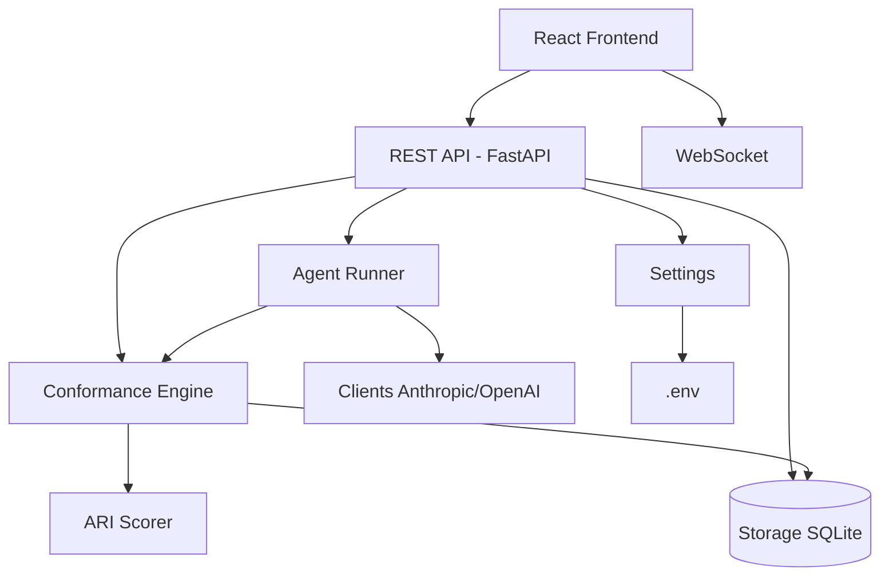

# System Architecture

## Overview
agent_ops is an AI Governance application that includes the Governance Harness: it loads configuration and policies, runs an agent that emits ATS events, evaluates every event against FSM-based policies (Write Approval Gate, Memory Sanitizer, Objective Alignment), updates the Agency-Risk Index (ARI), and exposes a REST API and WebSocket for dashboards and live intervention. It also orchestrates AI clients (Anthropic, OpenAI) and optional MCP/GPIO. All external input is validated via Pydantic; secrets stay in the environment. The system is local-first with cloud target TBD.

## Runtime Targets
- **Local:** primary target — development, governance workflows, policy enforcement, API + WebSocket server
- **Cloud:** none yet; to be selected later
- **Edge:** Raspberry Pi for GPIO / sensor workloads when HARDWARE_ENABLED=true

## Component Map

## Layer Responsibilities
- **REST API (src/api):** sessions CRUD, run agent, events/evaluations list, policies list/toggle, approve/deny write, presets, stats
- **WebSocket (src/api/ws):** subscribe by session_id; broadcast events and evaluations in real time
- **Governance (src/governance):** ATS schema, storage, Conformance Engine (three policies), ARI, Agent Runner (LLM plan, emit events, write-approval gate)
- **AI Clients:** thin wrappers over Anthropic/OpenAI SDKs with retry and error handling
- **MCP Client:** MCP tool invocation with Pydantic validation (server type TBD)
- **Hardware Layer:** GPIO abstraction, gracefully disabled when HARDWARE_ENABLED=false
- **Config:** pydantic-settings BaseSettings; DATABASE_URL, API_HOST, API_PORT for harness

## Key Constraints
- Secrets never leave the environment layer
- Hardware layer must degrade gracefully when not on Pi hardware
- All AI API calls must handle rate limits and token errors explicitly
